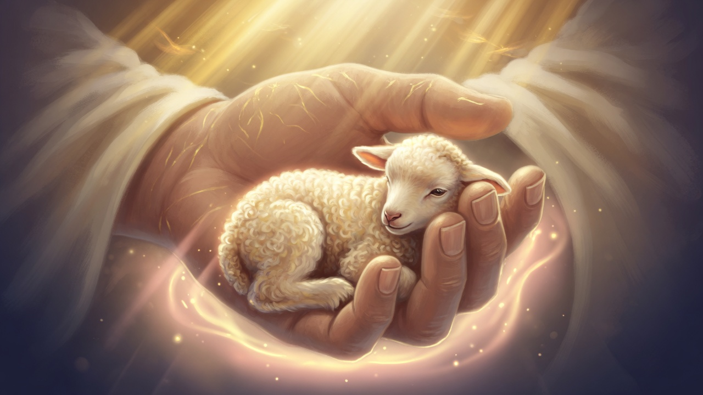
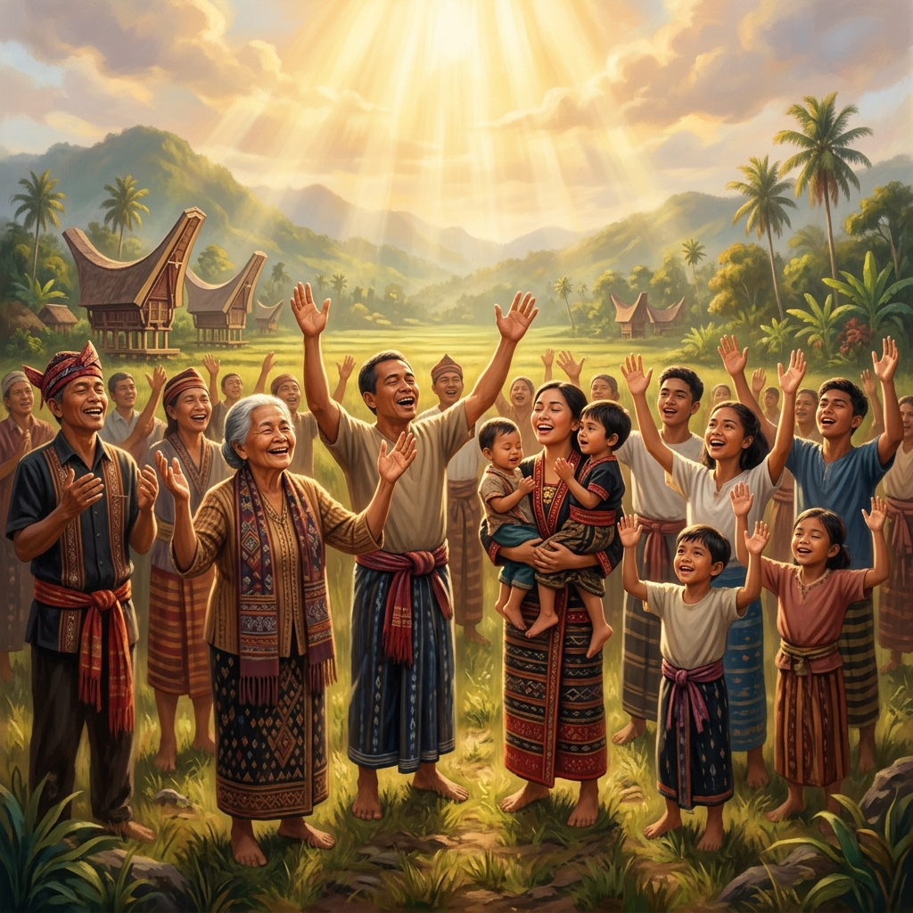

# Ide Gambar Tema: 14 Juni 2026
**Tema:** Menjadi Harta Kesayangan Allah  
**Mendadi Eanan Nakaboro'i Puang**

Berdasarkan analisis teologis dari bacaan Minggu III setelah Pentakosta, 14 Juni 2026, berikut adalah 4 konsep visual utama yang merangkum pesan dan tujuan khotbah, beserta prompt siap pakai untuk AI Image Generator.

Fokus utama visual:
- Status sebagai **harta kesayangan** yang diberikan sepenuhnya oleh kasih karunia Allah.
- Pemeliharaan Allah yang aman dan penuh kasih.
- Respons: menghidupi status dengan saling mengasihi, dan bersukacita bersama.

---

## 1. "Di Tangan Sang Pemilik" (Fokus: Keamanan & Pemeliharaan)
*Mendukung Mazmur 100 — "Dialah yang menjadikan kita... umat-Nya dan kawanan domba gembalaan-Nya"*

**Preview:**

### Deskripsi Visual
Tangan besar yang lembut dan penuh kasih dengan lembut memegang dan melindungi seekor domba kecil. Cahaya hangat yang kuat turun dari atas, membentuk aura pelindung di sekitar yang dipegang. Komposisi sangat intim dan penuh perasaan memiliki.

### Prompt AI
> **Semi-realistic digital painting of a large, gentle, and loving divine hand tenderly cupping and protecting a small lamb. Strong yet soft warm golden light pours down from above, creating a protective glowing aura around the lamb. Intimate, secure, and deeply cherished atmosphere. Soft dramatic lighting, warm golden and cream tones, highly detailed, emotional and reverent mood, church presentation quality, 16:9 aspect ratio, no text, no watermark.**

---

## 2. "Meterai Kasih Karunia" (Fokus: Anugerah yang Diberikan)
*Mendukung Roma 5 & Keluaran 19 — Kasih Allah yang menandai kita ketika kita masih lemah.*

**Preview:**

### Deskripsi Visual
Sebuah tanah liat yang sederhana, namun di atasnya baru saja dicapkan sebuah meterai kerajaan ilahi yang bersinar keemasan. Menekankan bahwa Allah memilih dan menjadikan kita berharga, meninggikan martabat murni karena kasih karunia.

### Prompt AI
> **Cinematic semi-realistic digital painting of a simple smooth stone or clay tablet being gently pressed with a divine royal seal. Warm golden light powerfully emanates from the point where the seal touches the object, illuminating the surrounding area with soft rays. Subtle mountain silhouette in the soft dark background. Extremely intimate, reverent, and precious atmosphere, symbolizing being God's treasured possession by grace. Soft dramatic lighting, rich warm golden highlights against deep earthy tones, church presentation quality, 16:9 aspect ratio, no text, no watermark.**

---

## 3. "Rantai Belas Kasihan" (Fokus: Menghidupi Status)
*Mendukung Matius 9-10 — Meneruskan belas kasihan kepada yang lelah dan telantar.*

### Deskripsi Visual
Seseorang yang dadanya memancarkan cahaya keemasan (tanda milik Allah), sedang membungkuk untuk menolong dan merangkul orang lain yang sedang duduk terpuruk di tempat yang lebih gelap. Kasih yang diterima diteruskan kepada sesama.

### Prompt AI
> **Cinematic semi-realistic digital painting showing believers living out their identity as God's treasured possession. A person whose chest softly glows with a warm golden light is gently bending down to help and embrace someone who is weary and marginalized in a darker area. The light from the helper gently illuminates the one being helped. Warm, hopeful, and deeply human atmosphere of compassion. Soft dramatic lighting, emotional, church presentation quality, 16:9 aspect ratio, no text, no watermark.**

---

## 4. "Sukacita Kawanan Domba" (Fokus: Komunitas yang Bersyukur)
*Mendukung Mazmur 100 — Sorak-sorai umat Tuhan yang beraneka ragam.*

**Preview:**

### Deskripsi Visual
Sekelompok orang dari berbagai usia (dengan sentuhan nuansa pakaian Toraja yang sederhana) berdiri berdampingan sambil tersenyum hangat, saling menengadah dengan penuh syukur di bawah sorotan sinar pagi yang lembut menyerupai payung kasih.

### Prompt AI
> **Semi-realistic digital painting of a diverse group of people of all ages standing together in a bright open field, expressing joyful worship with warm smiles and raised hands. They are wearing simple, subtle Torajan cultural clothing details. Soft warm golden morning light gently pours down from above like a canopy of love and protection. Atmosphere of deep gratitude, unity, and belonging. Hopeful, warm, soft dramatic lighting, cinematic composition, church presentation quality, 16:9 aspect ratio, no text.**

---

## Rekomendasi Penggunaan di Slide
| Slide | Konsep yang Cocok | Alasan |
|-------|-------------------|--------|
| Judul Utama / Pembuka | Konsep 1 atau 2 | Sangat kuat memvisualisasikan keamanan dan status sebagai milik istimewa. |
| Penjelasan Keluaran & Roma | Konsep 2 | Menggambarkan sentuhan inisiatif anugerah Allah bagi yang tidak layak. |
| Aplikasi (Matius 9-10) | Konsep 3 | Merupakan panggilan untuk meneruskan belas kasihan kepada sesama. |
| Penutup / Syukur (Mazmur 100) | Konsep 4 | Memberikan kesan komunitas yang hangat dan bersukacita bersama. |
