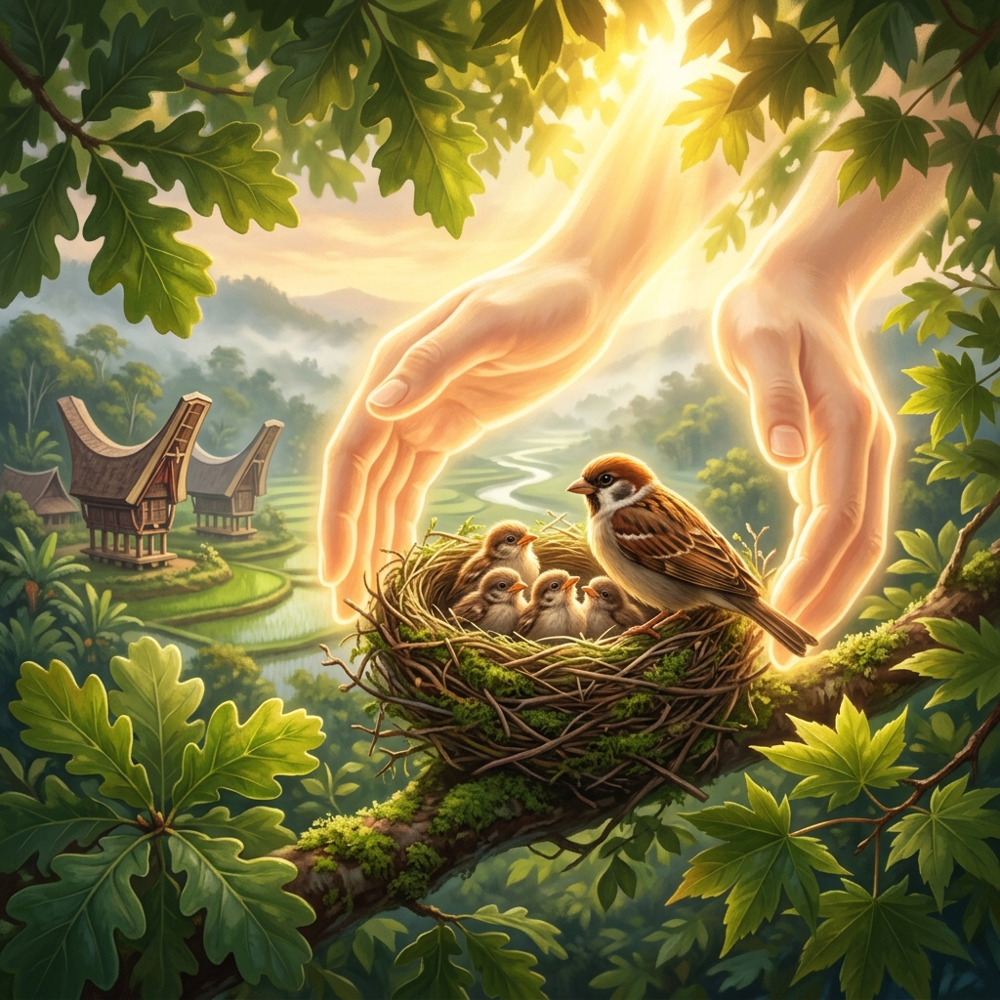
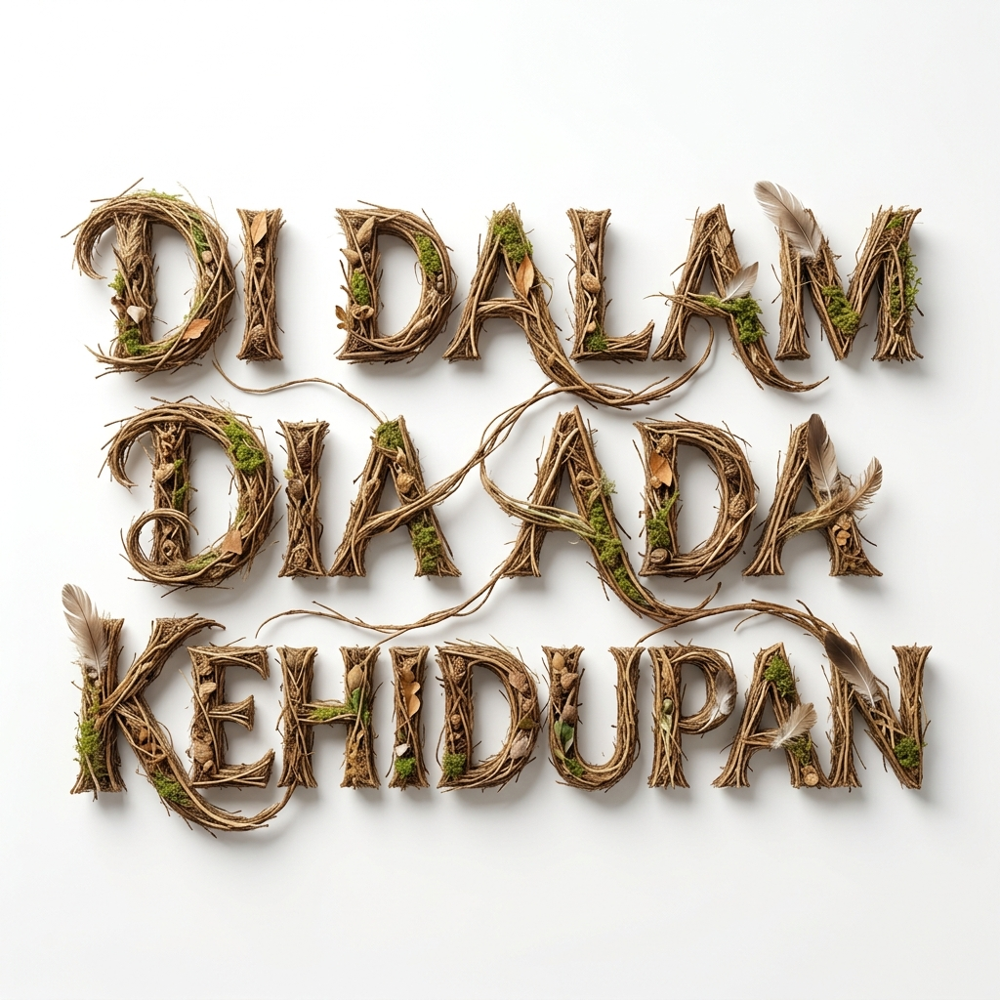

# Ide Gambar Tema: 21 Juni 2026
**Tema:** Di Dalam Dia Ada Kehidupan  
**Lan Puang Nanii Katuoan**

Berdasarkan analisis teologis dari bacaan Minggu IV setelah Pentakosta, 21 Juni 2026, berikut adalah 4 konsep visual utama yang merangkum pesan tema dan tujuan khotbah, beserta prompt siap pakai untuk AI Image Generator (seperti Midjourney atau DALL-E 3) yang dapat digunakan oleh tim multimedia/kreatif gereja.

Fokus utama visual:
- **Allah sebagai Sumber Kehidupan** yang memelihara secara ajaib dan detail.
- **Panggilan untuk Melekat** pada Kristus agar memperoleh kelimpahan hidup rohani.
- **Kematian terhadap dosa dan kebangkitan** ke dalam hidup baru.

---

## 1. "Mata Air di Padang Gurun" (Fokus: Kejadian 21:8-21 & Mazmur 86)
*Mendukung kisah Hagar & Ismael — Allah menyediakan kehidupan di tengah keputusasaan.*

### Deskripsi Visual
Di tengah padang gurun Bersyeba yang sangat tandus dan gersang di bawah terik matahari, muncul sebuah sumur batu kuno yang memancarkan air bersih dan segar. Di sekeliling oase kecil ini, tumbuh rumput hijau subur dan bunga-bunga kecil yang kontras dengan pasir gurun di sekelilingnya. Hagar dan Ismael berlutut di tepi mata air dengan ekspresi kelegaan yang mendalam, menengadah penuh syukur ke langit sementara cahaya keemasan ilahi lembut turun menyinari mereka.

### Prompt AI
> **Cinematic, semi-realistic digital painting of a miraculous oasis in the middle of a vast, harsh, and sun-drenched desert. A clear, fresh spring of water bubbles up from a stone well, watering the green grass and small wildflowers that grow around it in a vibrant circle. In the foreground, a mother and her son (representing Hagar and Ishmael) kneel by the water, drinking and looking up with expressions of profound relief and gratitude. Soft, divine golden light gently beams from heaven onto the spring. Warm, hopeful, and emotional mood, church presentation quality, 16:9 aspect ratio, no text, no watermark.**

---

## 2. "Melekat pada Pokok yang Benar" (Fokus: Tujuan 2 — Jemaat terus melekat)
*Mendukung konsep ranting yang hidup karena bersatu dengan pokok kehidupan.*

### Deskripsi Visual
Fokus dekat (*close-up*) pada dahan/ranting pohon anggur yang kokoh, melekat erat pada batang pokok yang kuat dan besar. Dari batang utama, mengalir cairan atau cahaya keemasan lembut (seperti nutrisi kehidupan) masuk ke dalam ranting-ranting tersebut. Ranting itu menghasilkan dedaunan hijau yang sangat segar dan buah anggur yang lebat serta ranum yang memancarkan kemilau sehat di bawah sinar matahari pagi yang cerah.

### Prompt AI
> **A close-up cinematic digital painting of a healthy grape branch tightly connected to a thick, strong grapevine trunk. A soft, warm golden light flows like life-giving sap from the main trunk into the branch, making its green leaves vibrant and its clusters of purple grapes glow with freshness. In the background, a beautiful vineyard under a soft, golden morning sun is softly blurred. Atmospheric, highly detailed textures, symbolizing abiding in Christ as the source of life. Reverent, peaceful mood, 16:9 aspect ratio, no text, no watermark.**

---

## 3. "Bangkit Menuju Hidup Baru" (Fokus: Roma 6:1-11 — Bacaan Utama)
*Mendukung pesan tentang mati bagi dosa dan bangkit untuk hidup baru di dalam Kristus.*

### Deskripsi Visual
Sebuah gambaran simbolis yang melambangkan kebangkitan rohani. Seseorang yang mengenakan jubah putih bersih melangkah keluar dari air baptisan yang tenang (atau dari makam batu gelap yang terbuka), menuju ke arah fajar pagi yang sangat cerah dengan warna langit keemasan dan jingga. Sosok tersebut tampak segar, bebas dari beban, dan menengadah ke atas dengan penuh kemenangan dan kedamaian.

### Prompt AI
> **Cinematic and symbolic digital art representing resurrection and new life. A person dressed in a simple, clean white robe walks out of a dark, cold stone tomb or still waters of baptism, stepping forward into a bright, warm golden sunrise. The light of the new day envelops the person with a radiant, glowing aura. The atmosphere is filled with freedom, hope, and victory. Soft dramatic lighting, rich warm colors contrasting with deep shadows, church presentation quality, 16:9 aspect ratio, no text, no watermark.**

---

## 4. "Dalam Lindungan Sayap-Nya" (Fokus: Matius 10:29-31)
*Mendukung pesan pemeliharaan Allah yang teliti bahkan atas burung pipit dan helai rambut kita.*

**Preview:**

### Deskripsi Visual
Sepasang tangan ilahi yang sangat besar, transparan, dan bercahaya keemasan lembut, membentuk kubah pelindung di atas sebuah sarang burung kecil di dahan pohon rindang. Di dalam sarang tersebut terdapat beberapa ekor burung pipit kecil yang tampak aman dan tenang. Cahaya matahari pagi menembus celah-celah daun, menciptakan suasana yang hangat, damai, dan aman. Di latar belakang yang tampak buram (*soft focus*), terlihat lanskap khas Toraja, Sulawesi Selatan dengan rumah adat Tongkonan dan hamparan persawahan terasering hijau di bawah kabut pagi yang lembut.

### Prompt AI
> **Semi-realistic digital painting of a pair of large, gentle, glowing hands of light hovering protectively over a nest of small sparrows on a leafy tree branch. A warm beam of golden sunlight filters through the leaves, illuminating the sparrows with warmth and safety. Peaceful, secure, and deeply comforting atmosphere representing God's meticulous care. In the softly blurred background, a beautiful Torajan landscape in Indonesia is visible, featuring traditional Tongkonan houses with curved roofs and terraced green rice fields under a warm morning mist. Soft focus, highly detailed, church presentation quality, 16:9 aspect ratio, no text, no watermark.**

---

## 5. Grafis Judul: "DI DALAM DIA ADA KEHIDUPAN"
*Grafis judul bertema sarang burung untuk slide pembuka atau transisi.*

**Preview:**

### Deskripsi Visual
Lukisan digital semi-realistis (*semi-realistic digital painting*) teks 3D bertuliskan "DI DALAM DIA ADA KEHIDUPAN". Setiap huruf dibentuk dan ditenun secara indah dari bahan-bahan sarang burung alami, seperti ranting kayu kecil, rumput kering kecokelatan, jerami, lumut hijau, dan bulu burung yang lembut. Huruf memiliki tekstur organik yang sangat detail dengan latar belakang putih bersih. Terdapat bayangan lembut di bawah huruf untuk memberikan kedalaman tiga dimensi yang tampak artistik.

### Prompt AI
> **A semi-realistic digital painting of 3D text spelling "DI DALAM DIA ADA KEHIDUPAN". The letters are beautifully formed and woven from natural bird's nest materials, including small twigs, dry brown grass, straw, bits of green moss, and soft feathers. The text has a detailed, organic, textured look. Clean, bright, pure solid white background. Soft shadows beneath the letters to give them a three-dimensional depth. Studio lighting, emotional and warm tones, church presentation quality, 16:9 aspect ratio, highly detailed texture, no other text.**

---

## Rekomendasi Penggunaan di Slide
| Slide / Bagian Ibadah | Konsep yang Cocok | Alasan |
|---|---|---|
| **Slide Pembuka / Judul Utama** | Konsep 5 (Grafis Judul) | Desain teks sarang burung yang unik dan bersih langsung menyampaikan tema ibadah secara eksplisit dan estetis. |
| **Latar Belakang Warta / Pembuka** | Konsep 2 (Pokok Anggur) | Menggambarkan secara visual makna "melekat" (*Lan Puang Nanii Katuoan*) secara universal dan indah. |
| **Pembacaan Roma 6 (BU)** | Konsep 3 (Hidup Baru) | Menguatkan pesan baptisan dan meninggalkan hidup lama demi hidup baru bersama Kristus. |
| **Pembacaan PL (Kejadian 21)** | Konsep 1 (Mata Air Gurun) | Sangat cocok menggambarkan pemeliharaan fisik dan pertolongan tepat waktu dari Allah. |
| **Aplikasi / Penutup (Matius 10)** | Konsep 4 (Burung Pipit) | Memberikan ketenangan jiwa bagi jemaat untuk tidak takut menghadapi tantangan hidup karena Allah memelihara. |
